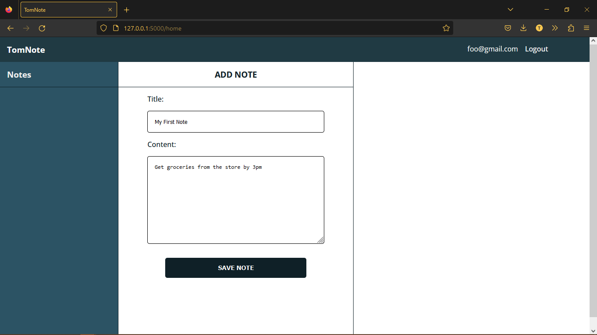
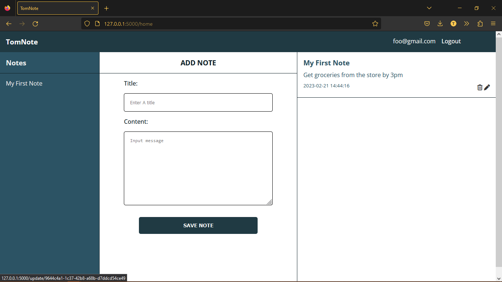
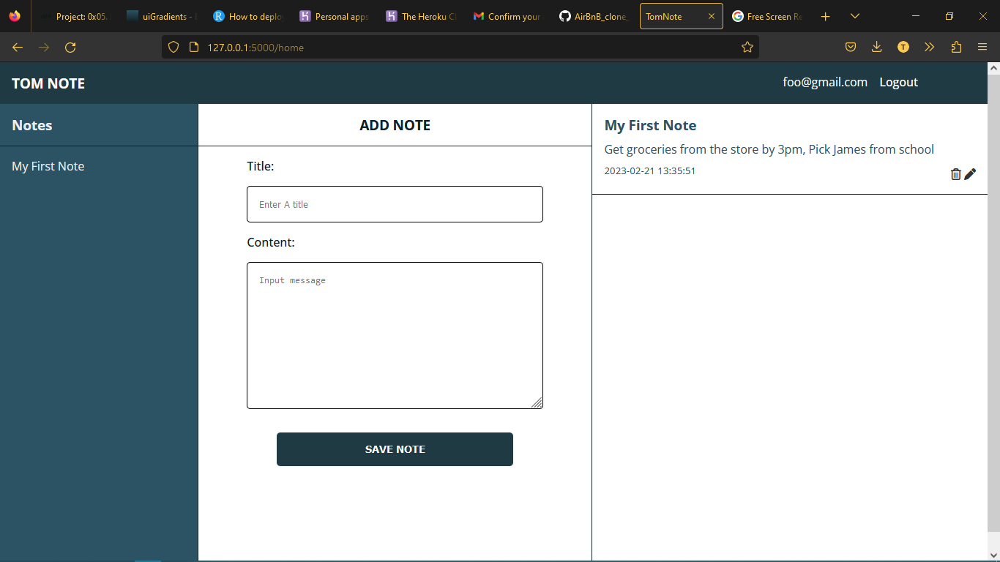
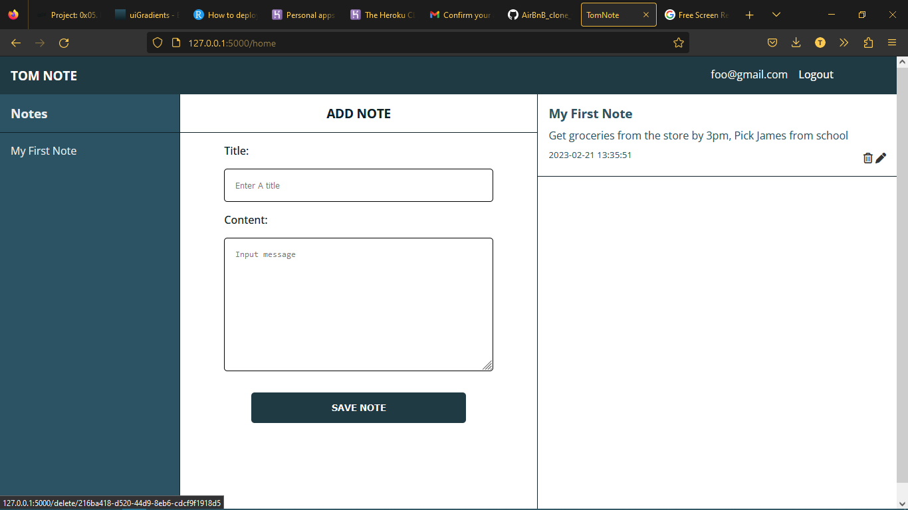
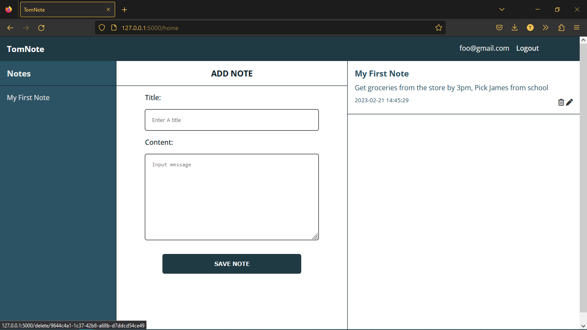
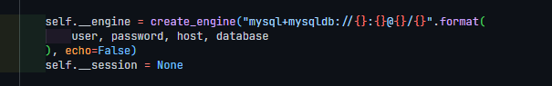

## Start of the backend task for Uptick talent

## Description
**Creation of an Note taking App that a user can create, read, edit and delete**

## Usage

After registration of account and login, the user gets access to the dashboard where he can create a note
like this:

And when the user clicks on save note, the note is saved and the user can see it in the dashboard

The user can also edit the note by clicking on the edit button (which is the pencil icon) when hovering over the saved
note

The text and title comes back in the form and the user can edit it and save it again

The user can also delete the note by clicking on the delete button (which is the trash icon) when hovering over the saved
note

When the user clicks on the delete button, the note is deleted and the user can no longer see it in the dashboard

## Installation
- **Clone this repository local computer**
- **Install the requirements from requirement.txt**
- **make sure to start the mysql server**
- **create a database to store the User and Notes**
- **update the class DB in [DB.py]() with the database name, username and password**

replace the variables with the database name, username and password
- **run the app.py file**
- **open the browser and go to http://
