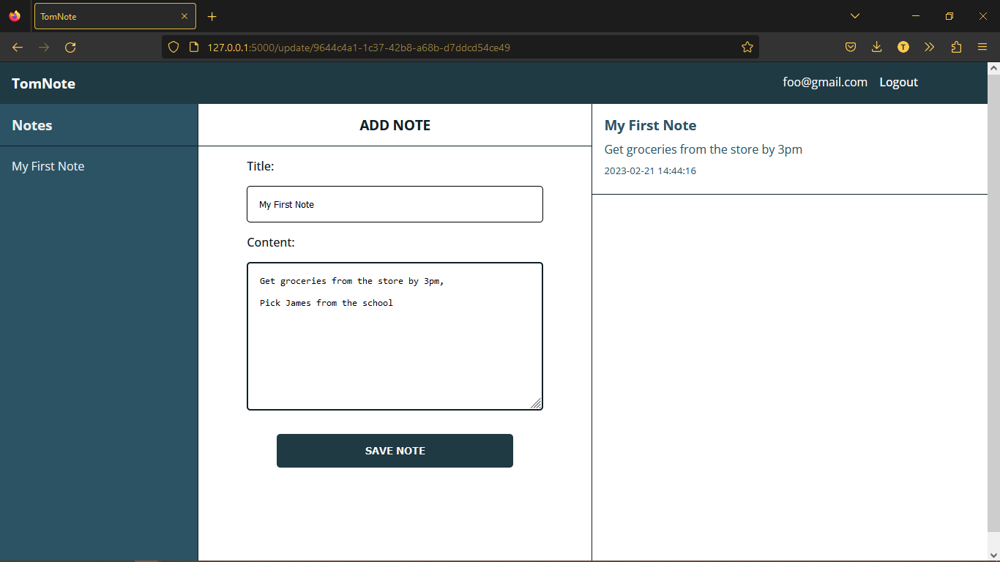

## Description
**Creation of a Note taking App that a User can create, read, edit and delete notes**

## Usage

**After registration of account and login, the user gets access to the dashboard where he can create a note**  
**like this:**

**And when the user clicks on save note, the note is saved and the user can see it in the dashboard**

**The user can also edit the note by clicking on the edit button (which is the pencil icon) when hovering over the saved note**

**The text and title comes back in the form and the user can edit it and save it again**

**The user can also delete the note by clicking on the delete button (which is the trash icon) when hovering over the saved
note**

**When the user clicks on the delete button, the note is deleted and the user can no longer see it in the dashboard**

## Installation
- **Clone this repository local computer**
- **Install the requirements from requirement.txt**
- **make sure to start the mysql server**
- **create a database to store the User and Notes**
- **update the class DB in [DB.py](https://github.com/tommydebisi/TomNote/blob/main/models/engine/db.py) with the `host`, `database name`, `username` and `password`**
- **set environment variables `NOTE_USER`, `NOTE_PASSWORD`, `NOTE_HOST` and `NOTE_DB` to the `username`, `password`, `host` and `database name` respectively**
- **run the app.py file**
- **open the browser and go to `127.0.0.1:5000` to view the app**
  
**Note: The app is hosted and can be found [HERE](http://bit.ly/3T4AdHf)**
